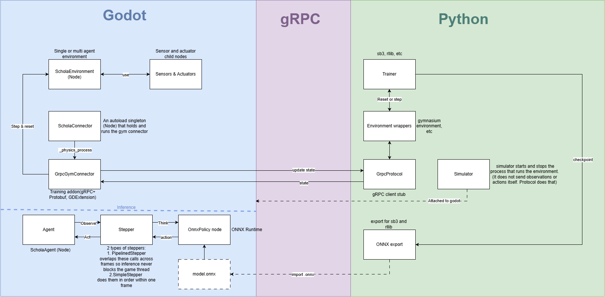

# AMD-Schola/The hard workers

## Product Details
 
#### Q1: What is the product?
We are building a Godot Engine port of AMD Schola, an open-source cross-platform reinforcement learning library currently built for Unreal Engine. We are partnering with AMD to extend their tool to support Godot. Our partners are Alexander Cann (Member of Technical Staff) and TianYue Liu, who also uses the name Michael (Senior Software Engineer). This tool will allow developers to natively define Reinforcement Learning (RL) Environments and Agents within Godot, attaching modular sensors and actuators, and connecting them to Python-based RL frameworks like Gymnasium, RLlib, or Stable-Baselines3. For example, a developer can create a racing car in Godot and train it to navigate a track using RL, without having to write the complex engine-to-Python communication logic from scratch.

#### Q2: Who are your target users?
- Game developers building NPCs or AI gameplay systems using Godot.
- AI / RL researchers needing a lightweight, accessible engine (Godot) as a training environment.
- Robotics and sim-to-real practitioners leveraging game engines for prototyping simulation environments before transferring to hardware.

#### Q3: Why would your users choose your product? What are they using today to solve their problem/need?
Currently, developers wanting to use Godot for RL either have to write custom sockets or RPC layers from scratch or rely on unofficial Godot integrations that are separate from Schola's maintained Python ecosystem. Our product brings Schola's environment, training, and inference workflow to Godot. The MVP saves developers from implementing engine-to-Python communication, episode coordination, space serialization, and local policy inference themselves. Reusable specialized sensor and actuator nodes are a stretch goal rather than an MVP promise. This supports AMD's goal of making Schola a maintained multi-engine platform with transferable concepts across engines.

#### Q4: What are the user stories that make up the Minumum Viable Product (MVP)?

These stories describe the minimum end-to-end product agreed upon during the initial AMD partner meeting: a Godot developer can define a simple reinforcement-learning environment, train an agent through Schola's existing Python ecosystem, export the learned policy, and run that policy inside Godot without Python.

Implementation tasks, ownership, dependencies, and progress are tracked on the team's [Trello board](https://trello.com/b/Ry0Qkx2R). This document states the user value and acceptance boundary; Trello breaks each story into engineering tasks.

##### US1: Define a reinforcement-learning environment

**Story:** As a Godot developer, I want to define a reinforcement-learning environment through a small engine-independent interface so that I can make an environment trainable without writing networking code.

**Acceptance criteria:**

- A developer can implement or configure the environment's initialization, reset, observation, reward, and terminal-state behavior.
- The environment can contain at least one agent.
- Environment code does not directly manage sockets, RPC calls, or serialized protocol messages.
- The environment accepts a reproducible random seed and optional reset configuration.
- Invalid or incomplete environment configuration produces a clear error.

##### US2: Declare observation and action spaces

**Story:** As a Godot developer, I want to define observation and action spaces using reusable types so that Schola can validate and communicate the agent's available inputs and outputs.

**Acceptance criteria:**

- The core supports Box, Discrete, MultiDiscrete, and MultiBinary spaces and their corresponding point values.
- Spaces expose their shape, bounds, and data type where applicable.
- An omitted Box bound represents an unbounded dimension rather than zero.
- An observation or action that does not match its declared space is rejected with a useful error.
- Space definitions can be translated to the representation expected by the existing Schola Python package.
- Round-trip tests serialize and deserialize spaces, points, interaction definitions, and agent states without changing their values.

##### US3: Connect to existing Python training tools

**Story:** As an ML practitioner, I want a Godot environment to connect to Schola's existing Python training tools so that I can train policies without maintaining a separate Godot-specific Python workflow.

**Acceptance criteria:**

- The Godot integration completes the connection and environment-definition exchange with the existing Python client.
- The integration uses Schola's existing protocol and gRPC services unless an alternative is approved by AMD.
- The transport implements `StartGymConnector`, `RequestTrainingDefinition`, and `UpdateState` from the existing Gym connector protocol.
- Python can discover the available environment, agents, observation spaces, and action spaces.
- The transport is isolated behind a core interface so the engine-independent code does not depend directly on gRPC.
- Connection failures and incompatible protocol data produce actionable errors instead of hanging the game or training process.

##### US4: Execute the episode lifecycle

**Story:** As an ML practitioner, I want Schola to coordinate observations, actions, rewards, terminal states, and resets so that training proceeds correctly across complete episodes.

**Acceptance criteria:**

- For each step, Godot supplies an observation and accepts a compatible action from Python.
- Each step returns the resulting observation, reward, and termination or truncation state.
- Reset restores the demonstration environment to a valid initial state and returns an initial observation.
- The connector supports the existing disabled, same-step, and next-step auto-reset modes with the same externally observable behavior as Schola's Python API.
- The connector can coordinate more than one environment in a running scene.
- An integration test completes multiple episodes without lifecycle deadlock or state leakage between episodes.

##### US5: Configure Schola through Godot-native tools

**Story:** As a Godot developer, I want to configure agents and environments through nodes and the Inspector so that I can use familiar Godot workflows instead of editing protocol or networking code.

**Acceptance criteria:**

- A developer can add the required Schola components to a scene using Godot's normal node workflow.
- Essential settings are visible and editable in the Inspector with understandable names and defaults.
- The demonstration project can be configured without modifying Schola's internal source code.
- The demonstration agent receives a small reward for moving backward, a larger reward for moving forward, and a penalty for remaining still.
- A configurable maximum step count truncates an episode that does not otherwise terminate.
- Running the scene reports missing or conflicting configuration clearly.

##### US6: Export a trained policy to ONNX

**Story:** As a Godot developer, I want to export a trained policy to ONNX so that I can transfer the learned policy from the Python training process into Godot.

**Acceptance criteria:**

- A policy trained with Stable-Baselines3 can be exported through Schola's existing Python export workflow.
- The resulting file is a valid ONNX model that can be opened by an independent model-inspection tool.
- The model's input and output names, shapes, and data types are documented for the inference implementation.
- A policy trained for the Godot demonstration environment is exported with inputs and outputs matching that environment's declared spaces.

##### US7: Run and ship an ONNX policy

**Story:** As a Godot developer, I want a trained policy to drive my agent with Python closed and to exclude training-only dependencies from exported games so that I can ship an autonomous agent without unnecessary training infrastructure.

**Acceptance criteria:**

- Godot loads the exported ONNX model and validates that its inputs and outputs match the agent's declared spaces.
- On each physics step, the agent follows an observe-infer-act loop that applies model output as its action.
- The demonstration agent performs the intended learned behavior while Python is not running.
- Missing, invalid, or incompatible model files produce a clear error.
- Training and transport code is packaged separately from the core environment API and inference code.
- A Godot export containing the demonstration environment runs its trained policy without Python or a live gRPC connection.
- The exported build excludes the training add-on without preventing the project from loading or using inference.
- The documentation identifies which modules are required for training and which are required in a shipped game.

##### Partner review

The team will send this artifact and the accompanying architecture to AMD through the shared Microsoft Teams channel. Evidence of that communication and any requested revisions will be linked here after the review.

#### Q5: Have you decided on how you will build it? Share what you know now or tell us the options you are considering.

> Short (1-2 min' read max)
 * What is the technology stack? Specify languages, frameworks, libraries, PaaS products or tools to be used or being considered.

Tech Stack:
* *Game engine:* Godot
* *Engine-side language:* GDScript or C# .net (to be discussed with partners)
* *RL-side* Python and Gymnasium
* *Communication:* gRPC with Protocol Buffers
* *Inference:* ONNX (model format) and ONNX Runtime (to run trained models inside Godot)

 * How will you deploy the application?

Schola-Godot is a developer library, not a hosted service, so there is no server to deploy. It will be distributed as a Godot **addon** that developers drop into their project's `addons/` folder, with the Python side installed via `pip` as Schola already is.
Training-only code (gRPC, connectors) will be packaged separately from the core and inference code, so a shipped game includes only what it needs to run a trained model. Longer term, the work is intended to be merged into AMD's open-source Schola repository.

 * Describe the architecture - what are the high level components or patterns you will use? Diagrams are useful here.
 
 Schola will to ported to Godot 4(4.7) with a C++ GDExtension addon. Runs on gPRC server using existing .proto contract(for details refer to diagram). The main components are ScholaEnvironment nodes with sensor and actuator children, a ScholaConnector autoload singleton that steps every environment, a C++ GrpcGymConnector, and an OnnxPolicy node for inference in exported games. Environments follow a template-method pattern where users override _initialize_environment, _reset, _step and _collect. gPRC hands requests to the main thread via producer-consumer queue. Note that each step runs in lockstep with physics, action at N frame and results collected in N+1. On the Python side, we are using Schola's protocol/simulator split(a strategy pattern) to keep necessary new code locked into simulator. Trained policies are exported to ONNX.

 * Will you be using third party applications or APIs? If so, what are they?
 No hosted or paid APIs. We only use open-source libraries that run locally:
*Godot side:* godot-cpp (to build the GDExtension), gRPC(to call methods on a server application) and Protobuf(training server, only in the training add-on), and ONNX Runtime (inference in shipped games).
*Python side:* Schola's existing package: Gymnasium(reinforcement learning library), Stable-Baselines3/RLlib(reinforcement learning library), PyTorch(machine learning and deep learning framework), ONNX export(to export ONNX).
*Testing:* pytest(python testing), plus GdUnit4(godot unit testing) or GUT(godot unit testing).

----
## Intellectual Property Confidentiality Agreement 
> Note this section is **not marked** but must be completed briefly if you have a partner. If you have any questions, please ask on Piazza.
>  
**By default, you own any work that you do as part of your coursework.** However, some partners may want you to keep the project confidential after the course is complete. As part of your first deliverable, you should discuss and agree upon an option with your partner. Examples include:
1. You can share the software and the code freely with anyone with or without a license, regardless of domain, for any use.
2. You can upload the code to GitHub or other similar publicly available domains.
3. You will only share the code under an open-source license with the partner but agree to not distribute it in any way to any other entity or individual. 
4. You will share the code under an open-source license and distribute it as you wish but only the partner can access the system deployed during the course.
5. You will only reference the work you did in your resume, interviews, etc. You agree to not share the code or software in any capacity with anyone unless your partner has agreed to it.

**Your partner cannot ask you to sign any legal agreements or documents pertaining to non-disclosure, confidentiality, IP ownership, etc.**

Briefly describe which option you have agreed to.

----

## Teamwork Details

#### Q6: Have you met with your team?

Do a team-building activity in-person or online. This can be playing an online game, meeting for bubble tea, lunch, or any other activity you all enjoy.
* Get to know each other on a more personal level.
* Provide a few sentences on what you did and share a picture or other evidence of your team building activity.
* Share at least three fun facts from members of you team (total not 3 for each member).

#### Q7: What are the roles & responsibilities on the team?

Describe the different roles on the team and the responsibilities associated with each role (e.g., frontend, database). 
 * Roles should reflect the structure of your team and be appropriate for your project. One person may have multiple roles.  
 * Add role(s) to your Team-[Team_Number]-[Team_Name].csv file on the main folder.
 * At least one person must be identified as the dedicated partner liaison. They need to have great organization and communication skills.
 * Everyone must contribute to code. Students who don't contribute to code enough will receive a lower mark at the end of the term.

List each team member and:
 * A description of their role(s) and responsibilities including the components they'll work on and non-software related work
 * Why did you choose them to take that role? Specify if they are interested in learning that part, experienced in it, or any other reasons. Do no make things up. This part is not graded but may be reviewed later.

#### Q8: How will you work as a team?

Describe meetings (and other events) you are planning to have. 
 * When and where? Recurring or ad hoc? In-person or online?
 * What's the purpose of each meeting?
 * Other events could be coding sessions, code reviews, quick weekly sync meeting online, etc.
 * You should have 2 meetings with your project partner (if you have one) before D1 is due. Describe them here:
   * You must keep track of meeting minutes and add them to your repo under "deliverables/minutes" folder
   * You must have a regular meeting schedule established for the rest of the term.  
  
#### Q9: How will you organize your team?

List/describe the artifacts you will produce to organize your team. (We strongly recommend that you use standard collaboration tools like Linear.app, Jira, Slack, Discord, GitHub.)

 * Artifacts can be To-Do lists, Task boards, schedule(s), meeting minutes, etc.
 * We want to understand:
   * How do you keep track of what needs to get done? (You must grant your TA and partner access to systems you use to manage work)
   * **How do you prioritize tasks?**
   * How do tasks get assigned to team members?
   * How do you determine the status of work from inception to completion?

Our team organizes work through Discord and Trello.

We use Discord for day-to-day communication and as a hub for our artifacts and important links. Our server has channels organized by deliverable and by user story, alongside dedicated channels linking to our Trello board, AMD Schola's GitHub repository, and our fork. We hold our meetings in Discord voice channels and document meeting minutes directly in our forked repository. Our TA and partners have been given access to our Discord server and Trello board so they can follow our progress.

We manage tasks and to-do lists on our Trello board, with cards organized into Not Started, In Progress, and Completed lists. We prioritize tasks by ordering cards within each list, so the most important or time-sensitive tasks sit at the top. As a team, we decide together how to break a deliverable into tasks, and members assign themselves as the owner of the tickets they take on.

To track status from inception to completion, we pair Trello with code reviews and a pull-request process: a card stays in "In Progress" while the corresponding work is being reviewed, and we only move it to "Completed" once the pull request has been approved and merged. This keeps our board reflecting what has actually been reviewed and merged, not just written.

#### Q10: What are the rules regarding how your team works?

**Communications:**
 * What is the expected frequency? What methods/channels will be used? 
 * If you have a partner project, what is your process for communicating with your partner? Who is responsible?

We expect daily communication as a team, mainly through quick check-ins on Discord, since it's already central to how we organize our work (see Q9).

For our partners, we have a Microsoft Teams group chat with AMD, and Vansh Sehrawat is our primary point of contact and partner liaison responsible for that channel. We plan to hold weekly meetings with them, tentatively Friday 11:00 a.m.–12:00 p.m., though this time still needs to be confirmed with AMD.

**Collaboration:**
 * How are people held accountable for attending meetings, completing action items? What is your process?
 * How will you address the issue if one person doesn't contribute or is not responsive?

We expect everyone to communicate proactively about attending meetings and completing action items. Our team has been active and engaged so far, so this hasn't been a problem, but if someone misses a meeting, that absence is recorded in the meeting minutes. This way, if it becomes a pattern, we can clearly present evidence to the person missing the meeting.

If a team member stops contributing, we will first talk to them directly to understand and address whatever is preventing them from contributing. If the issue continues and they remain unresponsive, we will escalate the situation to our TA and proceed from there.

## Organisation Details

#### Q11. How does your team fit within the overall team organisation of the partner?
Our team functions as an external feature expansion team for AMD. The partner's team developed the core Schola library and the Unreal implementation. We are taking the role of porting this functionality to a new engine (Godot), effectively opening up a new platform for their product. We act semi-autonomously, relying on their Unreal plugin as a reference architecture, and contributing back to their open-source ecosystem.

#### Q12. How does your project fit within the overall product from the partner?
Our project is a horizontal expansion of AMD Schola. Schola currently provides an Unreal Engine plugin and a Python package that supports reinforcement-learning frameworks such as Gymnasium, RLlib, and Stable-Baselines3. Our team is responsible for the initial Godot engine integration and will reuse the existing Python stack wherever practical. AMD continues to maintain the Python and Unreal components and can assist when multi-engine compatibility requires changes to them.

The Godot port is not intended to copy every Unreal feature or implementation decision. For this project, success is a small, well-designed, extensible core that completes one end-to-end workflow: define a simple environment in Godot, train a policy through Schola's Python tooling, export it to ONNX, and run it in Godot without Python. Training dependencies must remain separable from the runtime and inference components so they can be excluded from a shipped game.

## Potential Risks

#### Q13. What are some potential risks to your project?
* Now that you have defined your project, what risks can you identify that might impact it?
* Some examples of risks at this planning stage could include:
  * Uncertainties regarding a specific feature
  * Misaligned expectations or conflicts
  * Lack of clarity in execution or decision-making
  * Limited access to data, systems, or other dependencies
  * User stories that are too abstract or too simple
* For each risk, provide a brief bullet point and then explain the risk in detail. 

**1: The implementation language and extension mechanism are not settled.**
We have not determined what to use between GDScript, C#, and a C++ GDExtension. The choice affects most user stories, so changing it later would mean rewriting completed work.

**2: Hosting the gRPC server inside Godot may be difficult.**
Unreal Schola fully  relies on Unreal's build tooling for gRPC, while Godot has no equivalent. Thus, we must find a gRPC setup that works in Godot ourselves or a non-gPRC equivalent. This can cause divergence from the existing design.

**3: Parts of the Python stack are tied to Unreal.**
We cannot assume some Python components like launching the engine and exporting models can work with Godot unchanged. Changing them would add work outside our plan.

**4: The demonstration environment might not show learning within the time available.**
AMD's MVP requires a policy that learns the forward/backward/stand-still task. Getting an agent to could require reinforcement learning knowledge as training with bad settings might not produce wanted results.

**5: Decisions and acceptance criteria from AMD are still open.**
We do not have an guideline on what Godot version and whether multi-environment and multi-agent features are required. Without exact requirements, the result may not meet AMD's expectations.

#### Q14. What are some potential mitigation strategies for the risks you identified?
* Examples of mitigation strategies:
  * More communication with the partner might help with improving clarity.
  * Adding more details for an user story might make it less abstract.
  * Adding an extra user story might increase the project complexity, making it less simple.
* It's ok if you are unable to find mitigation strategies for all the risks right now.

**1: Language and extension mechanism.** 
Compare the options and at the weekly partner meeting ask AMD to make a decision after informing them.

**2: gRPC in Godot.** 
Build a small test gRPC prototype early to confirm if it works with the Python client. If it does not, discuss a fallback with AMD before other work depends on gPRC.

**3: Python stack tied to Unreal.** 
For the MVP, we could start Godot manually and connect from Python, which avoids Python code changes. Any later planned Python changes will be communicated to AMD beforehand.

**4: The demonstration might not show learning.** 
Firstly, keep the environment as simple as possible and learn online on how to properly tune training on a plain Python environment. If there are still tuning problems, ask AMD for recommended training settings.

**5: Open decisions from AMD.** 
For Godot version, compare the options and at the weekly partner meeting ask AMD to make a decision after informing them. For required features, communicate with AMD.